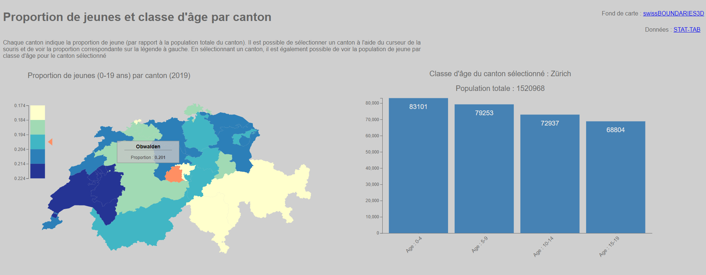
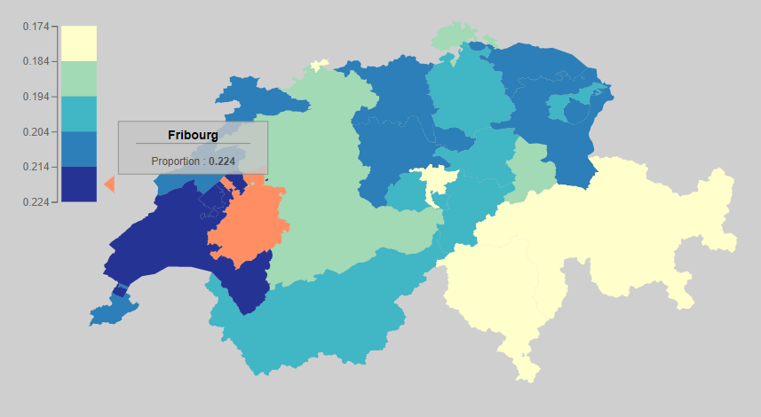
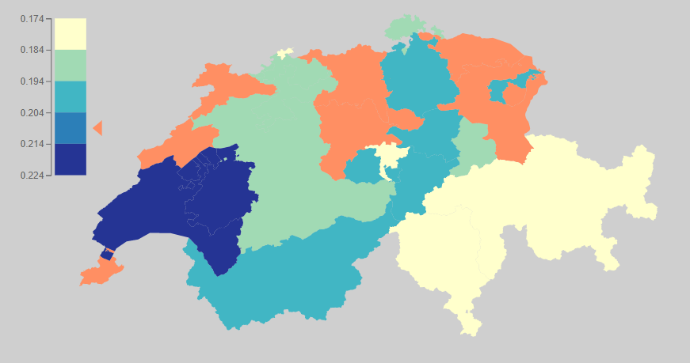
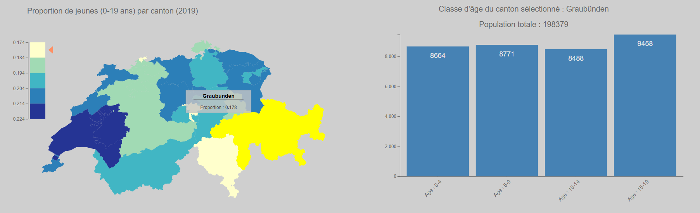

# Proportion de jeunes en Suisse par canton

## Description du projet

Ce projet a été réalisé dans le cadre du cours de [Visualisation de données](https://github.com/ipante/ressources_visualisation_de_donnees) dispensé par [Isaac Pante](https://github.com/ipante) à l'UNIL durant le master d'[Analyse Spatiale et Systèmes complexes](https://www.unil.ch/mastergeographie/fr/home/menuinst/presentation-msc-geo/orientation-assc.html).

Il s'agit d'une carte intéractive de la Suisse, basé sur les données de l'[OFS](https://www.bfs.admin.ch/bfs/fr/home/services/recherche/stat-tab-donnees-interactives.html), montrant la proportion de jeunes par canton ainsi que les différentes classes d'âge pour un canton donné.

## [D3](https://d3js.org/) (Data-Driven Documents)

Nous avons utilisé pour ce projet la libairie D3.js. cette librairie JavaScript permet de traiter des données de manière très aisée et facilite grandement leur visualisation.

## Habillage de la carte

### Base de données de l'OFS

[STAT-TAB](https://www.pxweb.bfs.admin.ch/pxweb/fr/)

STAT-TAB est une base de donnée en libre accès, mise à disposition par l'OFS (Office Fédéral des Statistiques). Elle permet de générer intéractivement des tableaux basés sur des statistiques suisses selon la thématique choisie.

Les données choisies ici sont :

* La proportion de jeunes par canton :
    * Il s'agit ici de créer une variable en divisant la somme population jeunes (entre 0 et 19 ans) par la population totale de chaque canton.
* La classe d'âge pour un canton :
    * Il s'agit ici de séparer les quatre classes d'âge qui composent les jeunes pour un canton, à savoir :
        * 0 - 4 ans
        * 5 - 9 ans
        * 10 - 14 ans
        * 15 - 19 ans

### Fond de carte swisstopo

[swissBOUNDARIES3D](https://www.swisstopo.admin.ch/fr/geodata/landscape/boundaries3d.html)

swissBOUNDARIES3D est un jeu de données mis à disposition gratuitement par swisstopo, qui regroupe un ensemble de géodonnées pour le territoire helvétique. En ce qui concerne ce projet, un fichier ShapeFile des limites administratives des cantons suisses a été extrait de ce jeu de données. Il a ensuite été converti en format [GeoJSON](https://geojson.org/) à l'aide de [QGIS](https://www.qgis.org/fr/site/) (un logiciel SIG) afin de traiter les géométries avec D3.

## Traitement des données

Les fichiers contenant les données (CSV et GeoJSON) ont été traité avec D3.js.
Chaque canton est désigné par son code respectif (diminutif du canton : ex : VD, VS, etc ...) dans les divers fichiers afin de faire les liens. Les divers enclaves réparties sur le territoire suisse ont été traitée en leur donnant un nom unique, à savoir (par ex.) : VD1, VD2, etc ... Cela a permis de pouvoir lier les enclaves aux cantons à qui elles appartiennent.

### Fichiers CSV

* `pop_cantons2.csv` : contient les données relatives à la proportion de jeunes par canton
    * Construction de la variable de proportion : (age_canton0_4 + age_canton5_9 + age_canton10_14 + age_canton15_19 / population_canton)
* `year_class.csv` : contient les classes d'âge pour chaque canton :
    * 0 - 4 ans
    * 5 - 9 ans
    * 10 - 14 ans
    * 15 - 19 ans
* `cantons_encl.geojson` : fichier GeoJSON contenant les géométries des cantons suisses ainsi qu'un ID unique correspondant au code du canton.

## Interface graphique

L'interface graphique se décompose en quatre parties principales :

* La description du programme et du phénomène (haut)
* La carte intéractive de la Suisse (gauche)
* La légende de la carte (gauche)
* Graphique en bar (droite)

### Carte interactive

La carte intéractive représente le territoire suisse, séparé en canton.
Il s'agit ici d'une carte choroplète montrant la proportion de jeunes par canton. Plusieurs intéractions sont possibles avec la carte :

* **Passer le curseur de sa souris sur un canton** :

*   
    * La couleur du canton change au orange
    * Un tooltip apparaît vers le curseur et indique le nom du canton en question ainsi que la proportion de jeunes exacte
    * Un curseur orange apparaît à droite de la légende pour indiquer à quelle classe de proportion le canton appartient

* **Passer le curseur de sa souris sur la légende** :

*   
    * Le curseur (triangle) de la légende suit le curseur de la souris
    * Les cantons qui ont une proportion de jeunes contenue dans la classe choisie par la légende sont *highlighté* en orange

* **Cliquer sur un canton** :

*   
    * *highlight* du canton en jaune
    * Apparition d'un *barplot* sur la droite de l'écran
        * Le barplot indique la population par classe d'âge du canton sélectionné
    * Le barplot se met à jour (avec animation) à chaque fois qu'un nouveau canton est sélectionné

## Utilisation du programme

La visualisation de ce programme doit se faire à l'aide d'un serveur local. Il existe plusieurs manière de monter son serveur :

### Visualisation avec Visual Studio Code

1. Télécharger le fichier ZIP et l'extraire dans le répertoire désiré
2. Ouvrir le dossier principal dans Visual Studio Code
3. S'assurer d'avoir l'extension `Live Server` installée sur VS Code
4. *Clique-droit* sur `index.html`, puis *open in Live Server*

### Visualisation grâce à la construction d'un serveur via python

1. Télécharger le fichier ZIP et l'extraire dans le répertoire désiré
2. Ouvrir votre terminal favori et changer votre répertoire pour l'endroit ou vous avez extrait le dossier :
    * `cd *path*` permet de changer le répertoire dans lequel vous êtes
3. Une fois dans le répertoire, générez le serveur en tapant `python3 -m http.server` dans votre invite de commande
4. Le `port HTTP` est ensuite spécifié : `http://[::]:8000/`
5. Il est alors possible de rentrer `localhost:8000` dans son navigateur afin d'afficher le programme

## Perspectives et limites

Il aurait été intéressant de pouvoir cliquer sur chaque barre du barplot afin d'avoir une information supplémentaire concernant la classe d'âge sélectionnée.

Il aurait également été intéressant de pouvoir changer d'année pour voir l'évolution de la proportion de jeune.

Afin de répondre aux variations de taille d'écran, une fonction `responsify` a été implémantée afin de re-calculer de manière dynamique l'étendue des plots (carte et barplot) lors du changement de taille de la fenêtre du navigateur.

L'implémentation de cette fonction a rendu le `tooltip` de la carte floue sur FireFox (pas sur Chrome ou Edge) lors du `mouseover`. En revanche, lorsque le canton en question est cliqué, le `tooltip` redevient net. 

Les bordures des géométries représentant les cantons ont été supprimées afin de grandement améliorer la performance du programme.

## Sources

Plusieurs extraits de code ont été utilisé afin de construire ce projet :

[datavis.fr](https://www.datavis.fr/index.php#d3js) proposent plusieurs tutoriels afin d'intégrer D3.js dans l'élaboration de cartes intéractives

[D3.js Graph Gallery](https://www.d3-graph-gallery.com/index.html) proposent des visualisations basiques avec D3.js

La [fonction Responsify](https://brendansudol.com/writing/responsive-d3) utilisée pour redimensionner les graphiques selon la taille de la fenêtre du navigateur a été inspirée par la fonction proposée par Brendan Sudol, 2014

[Isaac Pante](https://github.com/ipante/ressources_visualisation_de_donnees) La compréhension de D3.js s'est faite sur la base du contenu du cours proposé par Isaac Pante, UNIL.
